# AutoParts Hub – Mobil Uygulama (Flutter)

AutoParts Hub, otomotiv yedek parça alışverişini mobilde kolaylaştıran bir e-ticaret uygulamasıdır.  
Kullanıcılar araçlarına uygun parçaları arayabilir, filtreleyebilir, ürün detaylarını inceleyebilir ve sipariş oluşturabilir.  
Satıcılar ise ürünlerini yönetebilir, sipariş durumlarını güncelleyebilir ve satışlarını grafiklerle takip edebilir.

> Bu repo **mobil uygulama** içindir. Mobil uygulama, ortak bir **ASP.NET Core REST API** üzerinden web uygulamasıyla aynı verileri kullanır (senkron çalışma).

---

## İçindekiler
- [Proje Özeti](#proje-özeti)
- [Öne Çıkan Özellikler](#öne-çıkan-özellikler)
- [Ekran Görüntüleri](#ekran-görüntüleri)
- [Kullanım Senaryoları](#kullanım-senaryoları)
- [Roller ve Yetkiler](#roller-ve-yetkiler)
- [Teknoloji ve Mimari](#teknoloji-ve-mimari)
- [Kurulum](#kurulum)
- [Notlar](#notlar)

---

## Proje Özeti
**Amaç:** Kullanıcıların araçlarına uygun yedek parçayı hızlıca bulup satın alabileceği, satıcıların ise ürün/sipariş yönetimi yapabileceği mobil bir platform geliştirmek.

**Mobil uygulama ile neler yapılır?**
- Parça arama + gelişmiş filtreleme (kategori/marka/fiyat/stok/araç)
- Ürün detayında görsel galeri, soru-cevap ve değerlendirmeler
- Sepet ve ödeme akışı
- Hesap/profil yönetimi
- Satıcı paneli: ürün ekle/düzenle, sipariş durum güncelleme, satış grafikleri

---

## Öne Çıkan Özellikler
- **Modern UI (Material 3):** kart tabanlı, anlaşılır navigasyon
- **Araç odaklı deneyim:** Marka → Model → Yıl hiyerarşisi
- **Filtreleme sistemi:** aranan parçayı daraltma ve hızlı sonuç
- **Rol bazlı yapı:** User / Seller / SellerPending (kısıtlarla)
- **Satış analitiği:** satıcı panelinde line & bar chart (fl_chart)
- **API tabanlı mimari:** web ile ortak backend üzerinden veri senkronizasyonu

---

## Ekran Görüntüleri
> Görseller: 

### 1) Açılış ve Kimlik Akışı
| Splash | Kayıt Ol | Hesap (Guest) |
|---|---|---|
|  | 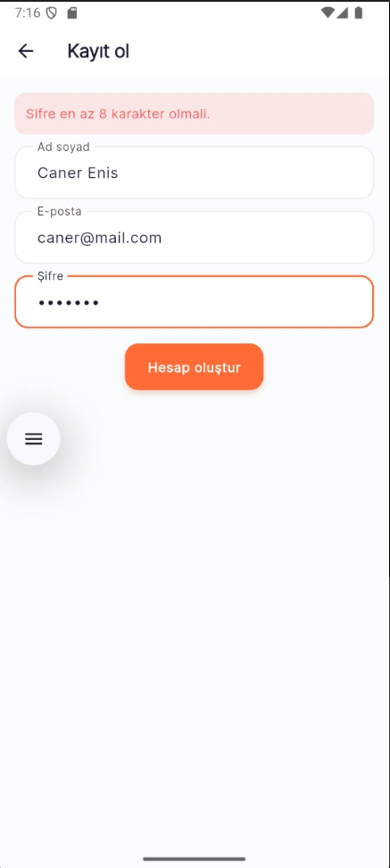 |  |

### 2) Ana Sayfa, Katalog ve Filtreleme
| Ana Sayfa | Parça Kataloğu | Filtre Modal |
|---|---|---|
| 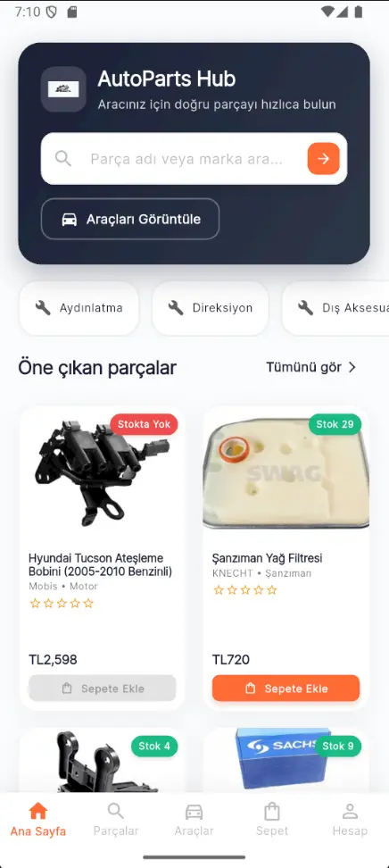 | 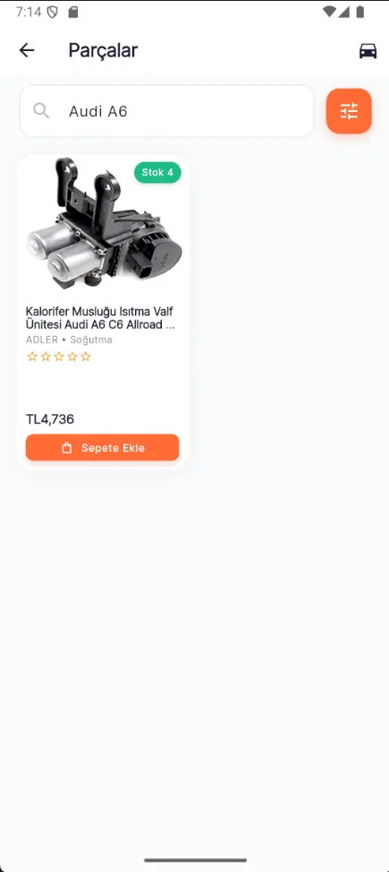 | 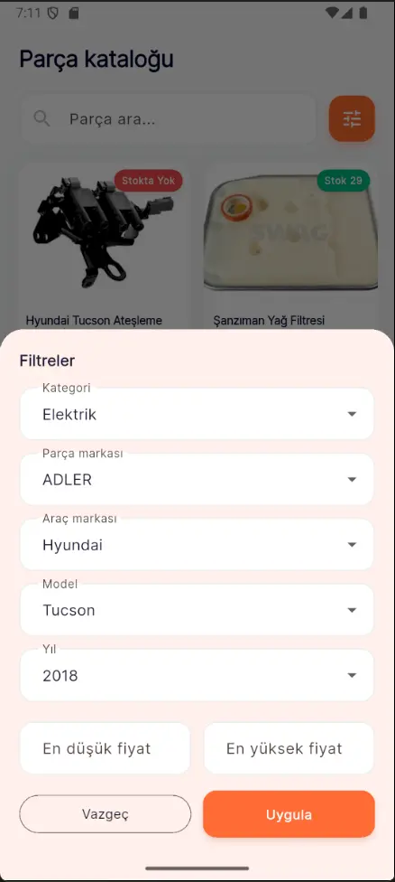 |

### 3) Ürün Detayı – Etkileşim (Soru / İnceleme)
| Ürün Detayı | Soru Sor (Modal) |
|---|---|
| 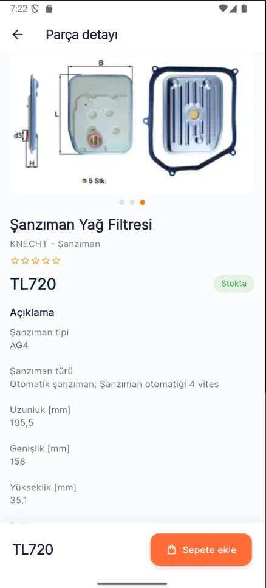 | 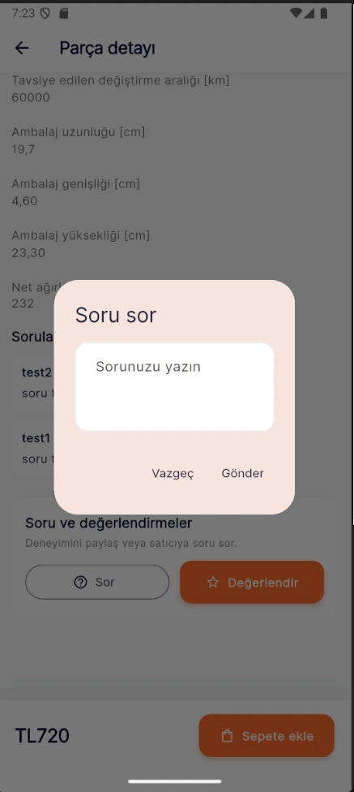 |

### 4) Araçlar (Vehicles) – Hiyerarşik Seçim
| Marka Listesi | Model Grid | Yıl Seçimi |
|---|---|---|
| 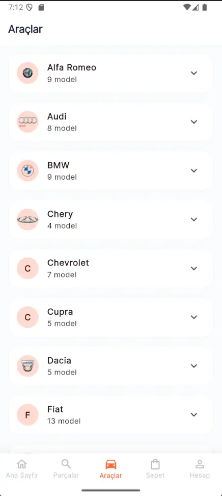 |  | 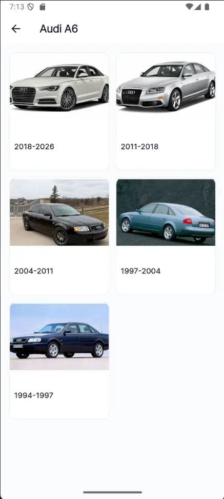 |

### 5) Sepet ve Ödeme
| Sepet | Ödeme |
|---|---|
| 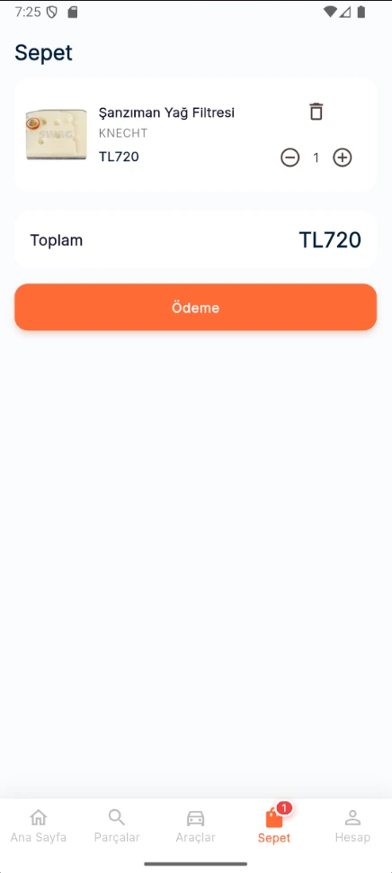 | 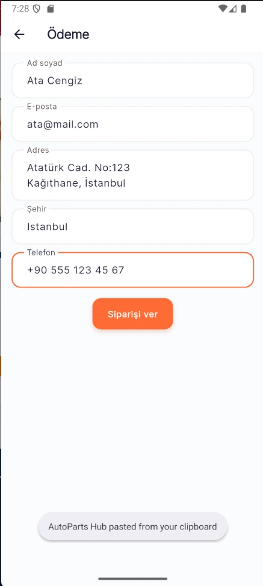 |

### 6) Hesap / Profil
| Hesap (User) | Profil Düzenle | Satıcı Başvurusu |
|---|---|---|
|  | 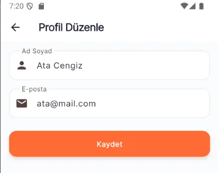 | 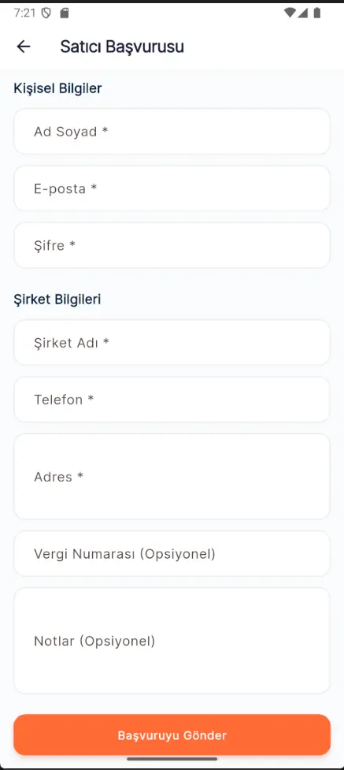 |

### 7) Siparişler – Kullanıcı ve Satıcı
| Kullanıcı Siparişleri | Satıcı Siparişleri | Durum Seç |
|---|---|---|
| .webp) | 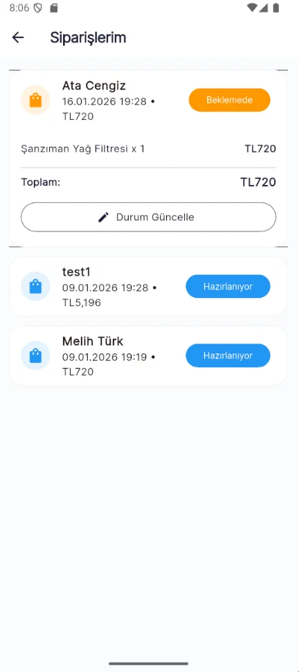 | 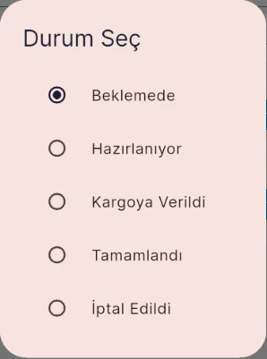 |

### 8) Satıcı Paneli – Dashboard ve Ürün Yönetimi
| Satıcı Paneli (Özet Kartlar + Satış Analizi) | Satıcı Paneli (Grafikler + Hızlı İşlemler) |
|---|---|
| 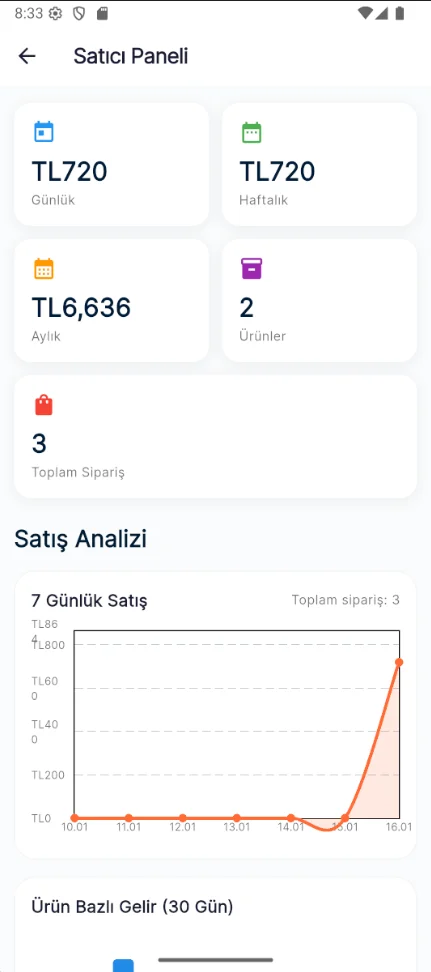 | 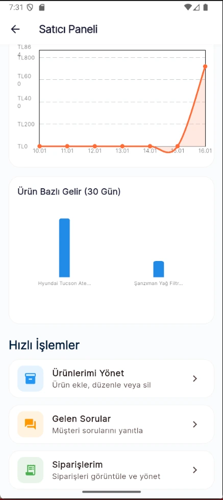 |

| Ürünlerim | Yeni Ürün |
|---|---|
| 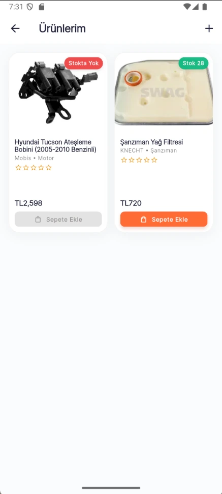 | 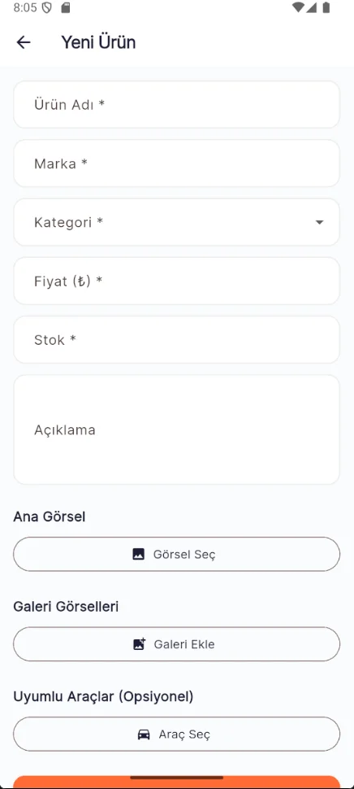 |

| Ürün Düzenle | Satıcı Hesap (Rol) |
|---|---|
|  |  |


> Alternatif satıcı hesap ekranı:  
> .webp)

---

## Kullanım Senaryoları
### Senaryo 1: Kullanıcı parça satın almak istiyor
1. Ana sayfadan parça kataloguna geçer  
2. Arama + filtreleme ile aradığı parçayı daraltır  
3. Ürün detayında görselleri inceler, soru sorabilir  
4. Sepete ekler, ödeme ekranından siparişi oluşturur  
5. Siparişlerim ekranından durum takibi yapar

### Senaryo 2: Satıcı ürün eklemek ve sipariş yönetmek istiyor
1. Satıcı paneline girer, satış grafikleri/özetleri görüntüler  
2. Yeni ürün ekler veya ürün düzenler (görsel + galeri + uyumlu araçlar)  
3. Siparişlerde durum günceller (Beklemede → Hazırlanıyor → Kargoya Verildi → Tamamlandı)

---

## Roller ve Yetkiler
- **User:** arama, filtreleme, sepet/checkout, değerlendirme, soru sorma
- **Seller:** ürün yönetimi, sipariş yönetimi, soru yönetimi, dashboard
- **SellerPending:** satıcı başvurusu onay bekler (kısıtlar uygulanabilir)

---

## Teknoloji ve Mimari
**Mobil:** Flutter (Dart), Provider, http, image_picker, fl_chart, Material 3  
**Backend (ortak):** ASP.NET Core REST API (JWT ile kimlik doğrulama)

Veri akışı:
```txt
Mobil Uygulama  <->  REST API  <->  Backend  <->  Veritabanı
